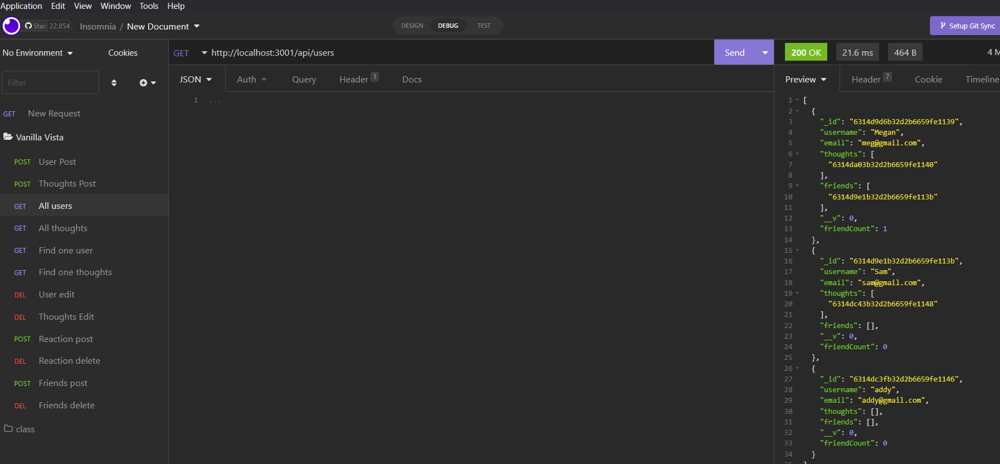

# VanillaVistas

 
  
## Description 
  
  VanillaVistas is the back end of a social media platform. It allows users to create an account, create thoughts, add friends, and react to thoughts. It was created using javascript, html, css, MongoDB, and Mongoose. 
  
## Table of Contents 
  
[Description](#description)
[Installation](#installation)
[Usage](#usage)
[License](#license)
[Contribute](#contribute)
[Tests](#tests)
[Questions](#questions)
   
## Installation
  
  Using github, clone down the repository. Insomnia can be used to test the routes.
  
## Usage
  
  This product would be used to create the back end of a fancy new social media platform called VanillaVistas. This creates the routes, models, and other information for using a back end NoSQL website.
  
## License
  
  MIT
  [MIT License page](https://opensource.org/licenses/MIT)
  
## Contribute
  
  Nothing may be contributed
  
  ## Tests
  
  Tests were done manually through heroku.
  
  ## Questions
  
  GitHub: [Elenalaree](https://github.com/elenalaree)

  

